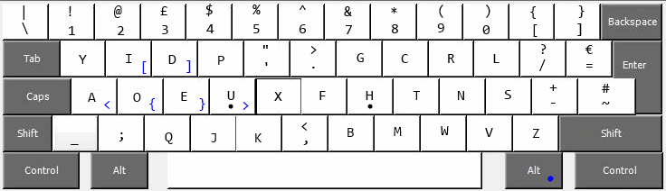

Dvorunk
=======

An experimental keyboard layout for windows and linux

Why?
------
I wanted a keyboard layout that requires the minimum of movement from home position.
This is that layout; It's very similar to the Dvorak Simplified layout, but with all alphabet keys in non-stretch positions.

Todo:
-----
* Fix the scan codes in the windows driver
* Swap the symbols and numbers at the top row
* Make a Linux xkbd driver
* Explain to co-workers why they can't make my machine work...

if possible, it would be nice to get alt-gr arrow keys.
