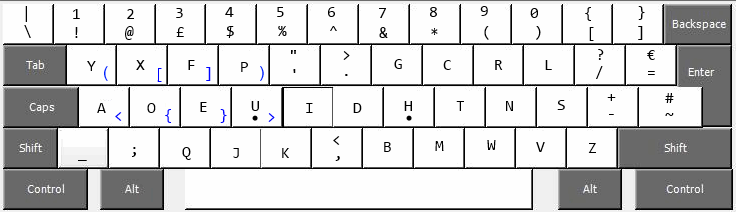

Dvorunk
=======

An experimental keyboard layout for windows and linux

Why?
------
I wanted a keyboard layout that requires the minimum of movement from home position.
This is that layout; It's very similar to the Dvorak Simplified layout, but with all alphabet keys in non-stretch positions.
It's also a UK Dvorak layout for Windows.

How?
-----
For Windows, run setup.exe

For Linux, call `xmodmap modmap`.
The Linux modmap doesn't support alt-gr keys yet.

Programmer Specific Features
-----------------------------
* Alt-Gr grouping keys (try ctrl-alt + Y,I,D,P,A,O,E,U)
* Shift swapped numeric row

Todo:
-----
* Explain to co-workers why they can't make my machine work...

if possible, it would be nice to get alt-gr arrow keys.
